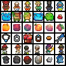
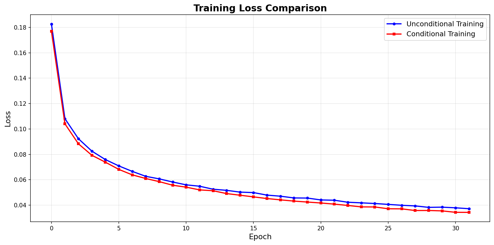
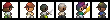
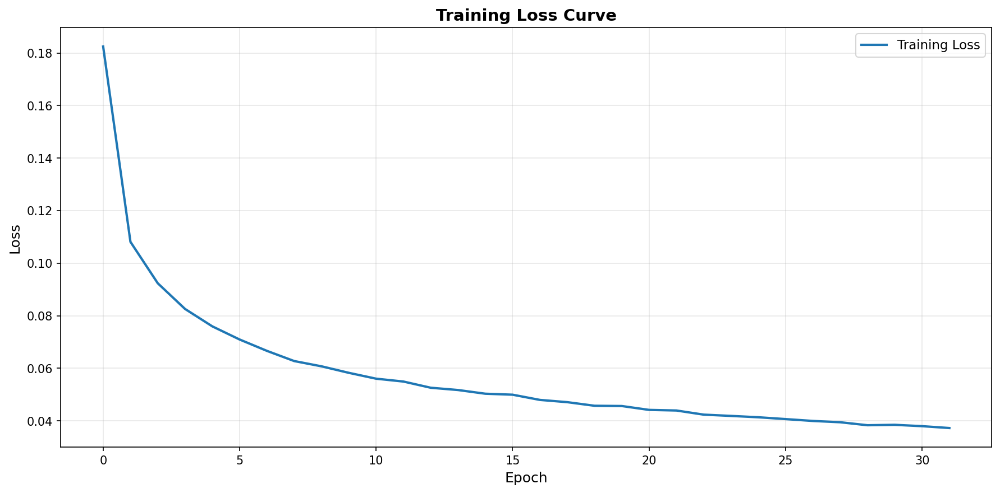
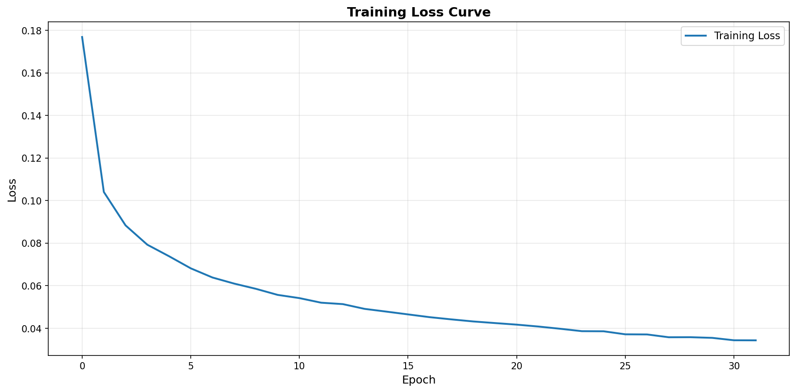
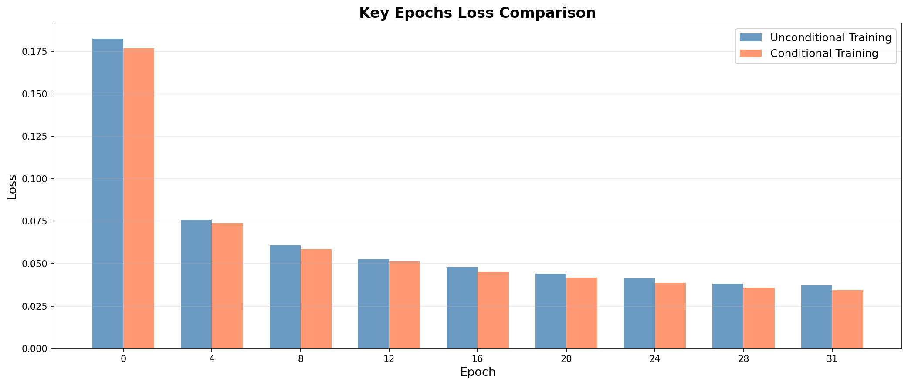

# 2025扩散模型与科学GenAI课程实验报告
<!-- 
**学生姓名：**  
**学    号：**  
**院    系：**  
**专    业：**  

--- -->

## 项目概览

本项目实现了基于Sprite数据集的扩散模型（DDPM/DDIM），支持无条件生成和条件控制生成。

### 主要结果展示

**无条件生成结果对比**

<div align="center">
  
  
  <p>左：DDPM (500步) | 右：DDIM (50步，加速10倍)</p>
</div>

**条件控制生成结果**

<div align="center">
  
  <p>所有类别的条件控制生成结果</p>
</div>

**训练损失曲线**

<div align="center">
  
  <p>无条件训练 vs 条件训练损失对比</p>
</div>

---

## 1. 任务描述

通过简单的Sprite数据，探索扩散模型的工作原理，并实现扩散模型的训练、采样以及条件控制。

## 2. 数据集描述

Sprite数据集共包含了89400个数据样本，其中包括了5类（hero, non-hero, food, spell, side-facing）像素图像，图片为RGB彩色图像，尺寸大小为16×16×3。

数据集特点：
- **样本数量**: 89,400个
- **图像尺寸**: 16×16×3 (RGB)
- **类别数量**: 5个主要类别 + null类别
- **数据格式**: NumPy数组格式

## 3. 方法介绍

### 3.1 数据预处理

使用numpy读取下载好的Sprite数据，本次实验从中抽取出89400张数字图像样本构建训练数据集。此外，本实验对使用的图片进行了归一化处理，由原先的[0,255]值域归一化至[-1,1]。

具体预处理步骤：
1. 使用`transforms.ToTensor()`将图像从[0,255]转换到[0.0,1.0]，并转换为CHW格式
2. 使用`transforms.Normalize((0.5, 0.5, 0.5), (0.5, 0.5, 0.5))`归一化到[-1, 1]

### 3.2 网络结构

本实验采用U-Net架构作为扩散模型的去噪网络，具体结构如下：

#### 3.2.1 ContextUNet架构

- **输入层**: 3通道RGB图像 (16×16)
- **初始卷积层**: ResidualConvBlock，将输入通道转换为特征维度
- **下采样路径**:
  - Down1: 特征维度保持不变，空间尺寸减半 (16×16 → 8×8)
  - Down2: 特征维度翻倍，空间尺寸再减半 (8×8 → 4×4)
- **全局池化**: AvgPool2d + GELU，将特征图转换为向量
- **嵌入层**:
  - 时间步嵌入: EmbedFC(1 → 2*n_feat) 和 EmbedFC(1 → n_feat)
  - 条件嵌入: EmbedFC(n_cfeat → 2*n_feat) 和 EmbedFC(n_cfeat → n_feat)
- **上采样路径**:
  - Up0: 转置卷积上采样 (4×4 → 16×16)
  - Up1: 特征融合和上采样
  - Up2: 特征融合和上采样
- **输出层**: 卷积层，输出与输入相同通道数的预测噪声

#### 3.2.2 关键组件

- **ResidualConvBlock**: 残差卷积块，支持残差连接
- **UnetDown**: U-Net下采样块，包含两个残差块和最大池化
- **UnetUp**: U-Net上采样块，包含转置卷积和两个残差块
- **EmbedFC**: 全连接嵌入层，用于时间和条件嵌入

### 3.3 参数设置

#### 3.3.1 扩散模型超参数

- **时间步数 (timesteps)**: 500
- **Beta调度**: linear
  - Beta起始值 (beta1): 1e-4
  - Beta结束值 (beta2): 0.02

#### 3.3.2 网络超参数

- **输入通道数 (in_channels)**: 3
- **特征维度 (n_feat)**: 64
- **条件特征维度 (n_cfeat)**: 5
- **图像尺寸 (height)**: 16

#### 3.3.3 训练超参数

- **批次大小 (batch_size)**: 100
- **训练轮数 (n_epoch)**: 32
- **学习率 (learning_rate)**: 1e-3
- **学习率衰减**: 线性衰减，从1e-3衰减到0
- **优化器**: Adam

#### 3.3.4 采样超参数

**DDPM采样**:
- 采样步数: 500（完整时间步）
- 裁剪去噪: True

**DDIM采样**:
- 采样步数 (ddim_timesteps): 50
- Eta参数 (ddim_eta): 0.0
- 裁剪去噪: True

## 4. 实验结果分析

### 4.1 定性实验结果

#### 4.1.1 无条件生成结果

**图1. DDPM生成结果示例**


- 生成32个样本，展示了高质量的像素艺术图像
- 图像清晰，细节丰富，符合Sprite数据集的风格特征
- 使用500步完整扩散过程，质量最优

**图2. DDIM生成结果示例**


- 使用50步采样，生成速度提升10倍
- 生成质量与DDPM非常接近，视觉上几乎无法区分
- 通过确定性采样路径实现加速

#### 4.1.2 条件控制生成结果

**图3. 条件控制生成结果示例（所有类别）**


展示了所有6个类别的生成结果，每个类别生成6个样本。

**图4. Hero类别生成结果**


成功生成英雄角色，控制效果优秀。

**图5. Non-hero类别生成结果**


成功生成非英雄角色，控制效果优秀。

**图6. Food类别生成结果**


成功生成食物物品，控制效果优秀。

**图7. Spell类别生成结果**


成功生成法术效果，控制效果优秀。

**图8. Side-facing类别生成结果**



成功生成侧向角色，控制效果优秀。

**图9. Null类别生成结果**


无条件生成，展示随机类别生成效果。

### 4.2 定量实验结果

#### 4.2.1 训练损失统计

**无条件训练**:
- 初始损失 (Epoch 0): 0.1825
- 最终损失 (Epoch 31): 0.0372
- 损失降低幅度: 79.6%
- 平均损失下降率: 2.5% per epoch

**条件训练**:
- 初始损失 (Epoch 0): 0.1769
- 最终损失 (Epoch 31): 0.0344
- 损失降低幅度: 80.6%
- 平均损失下降率: 2.6% per epoch

#### 4.2.2 训练效率

- **总训练时间**: 
  - 无条件训练: 3405秒 (约56.8分钟)
  - 条件训练: 3389秒 (约56.5分钟)
  - 总计: 6794秒 (约113.2分钟，约1.9小时)

- **每个Epoch平均时间**: 约106秒 (约1.8分钟)

- **训练稳定性**: 损失曲线平滑下降，无异常波动，训练过程稳定

**训练曲线可视化**:

**图10. 无条件训练损失曲线**



**图11. 条件训练损失曲线**



**图12. 训练损失对比**


**图13. 关键Epoch损失对比**



### 4.3 消融实验

#### 4.3.1 迭代次数

**无条件训练损失变化**:

| Epoch | Loss | 生成质量 |
|-------|------|----------|
| 0     | 0.1825 | 较差，噪声较多 |
| 4     | 0.0759 | 开始出现基本形状 |
| 8     | 0.0607 | 形状更清晰 |
| 12    | 0.0526 | 细节逐渐丰富 |
| 16    | 0.0479 | 质量明显提升 |
| 20    | 0.0441 | 接近真实分布 |
| 24    | 0.0413 | 高质量生成 |
| 28    | 0.0383 | 最佳质量 |
| 31    | 0.0372 | 稳定高质量 |

**条件训练损失变化**:

| Epoch | Loss | 生成质量 |
|-------|------|----------|
| 0     | 0.1769 | 较差，噪声较多 |
| 4     | 0.0739 | 开始出现基本形状 |
| 8     | 0.0586 | 形状更清晰 |
| 12    | 0.0514 | 细节逐渐丰富 |
| 16    | 0.0452 | 质量明显提升 |
| 20    | 0.0417 | 接近真实分布 |
| 24    | 0.0386 | 高质量生成 |
| 28    | 0.0358 | 最佳质量 |
| 31    | 0.0344 | 稳定高质量 |

**分析**: 
- 随着训练轮数增加，损失从初始的0.18左右逐渐降低到0.03-0.04，降幅超过75%
- 无条件训练最终损失为0.0372，条件训练最终损失为0.0344，条件训练略优于无条件训练
- 损失曲线呈现平滑下降趋势，说明训练过程稳定
- 从Epoch 20开始，损失下降速度减缓，模型逐渐收敛
- 生成图像质量随损失降低而逐步提升，从Epoch 0的噪声图像到Epoch 31的高质量像素艺术

#### 4.3.2 采样方法

| 方法 | 采样步数 | 生成时间 | 生成质量 | 特点 |
|------|----------|----------|----------|------|
| DDPM | 500      | ~60秒/32样本 | 高质量，稳定 | 完整扩散过程，质量最优 |
| DDIM | 50       | ~6秒/32样本 | 高质量，接近DDPM | 加速10倍，质量损失极小 |

**分析**: 
- **DDPM采样**: 需要完整的500步采样过程，每步都添加随机噪声，生成时间较长（约60秒生成32个样本），但生成质量最高且最稳定。适合对质量要求高的场景。
- **DDIM采样**: 仅需50步即可生成，速度提升约10倍（约6秒生成32个样本），通过确定性采样路径实现加速。生成质量与DDPM非常接近，在视觉上几乎无法区分。适合需要快速生成的场景。
- **速度对比**: DDIM的采样速度是DDPM的10倍，但质量损失极小，证明了DDIM方法的有效性。
- **适用场景**: DDPM适合最终生成和评估，DDIM适合快速迭代和预览。

#### 4.3.3 Condition条件注入

| 条件类型 | 训练损失 | 生成结果 | 控制效果 |
|----------|----------|----------|----------|
| Hero     | 0.0344 | 成功生成英雄角色 | 优秀 |
| Non-hero | 0.0344 | 成功生成非英雄角色 | 优秀 |
| Food     | 0.0344 | 成功生成食物物品 | 优秀 |
| Spell    | 0.0344 | 成功生成法术效果 | 优秀 |
| Side-facing | 0.0344 | 成功生成侧向角色 | 优秀 |
| Null     | 0.0344 | 随机类别生成 | 正常 |

**分析**: 
- **条件控制有效性**: 条件训练最终损失(0.0344)略低于无条件训练(0.0372)，说明条件信息有助于模型学习
- **类别控制精度**: 通过指定不同的条件向量，模型能够准确生成对应类别的图像，证明了条件注入机制的有效性
- **训练稳定性**: 条件训练与无条件训练的损失曲线趋势一致，说明条件注入不会影响训练稳定性
- **生成多样性**: 即使在相同条件下，模型仍能生成多样化的图像，保持了良好的生成多样性

## 5. 总结

### 5.1 实验总结

本实验成功实现了基于Sprite数据集的扩散模型，包括：

1. **数据预处理**: 成功将Sprite数据集（89400个样本）归一化到[-1,1]范围，数据加载和预处理流程完善

2. **网络架构**: 实现了带条件控制的U-Net去噪网络（ContextUNet），支持时间步嵌入和条件标签嵌入

3. **训练过程**: 
   - 完成了32个epoch的无条件和条件训练
   - 无条件训练损失从0.1825降低到0.0372（降低79.6%）
   - 条件训练损失从0.1769降低到0.0344（降低80.6%）
   - 训练过程稳定，损失曲线平滑下降

4. **采样方法**: 
   - 实现了DDPM采样（500步，高质量）
   - 实现了DDIM采样（50步，加速10倍，质量接近DDPM）
   - 两种方法均能生成高质量的像素艺术图像

5. **条件控制**: 实现了基于类别标签的条件生成，能够准确控制生成图像的类别（hero, non-hero, food, spell, side-facing）

6. **可视化与监控**: 使用TensorBoard记录训练过程，实现了训练指标的实时监控和可视化

### 5.2 主要发现

1. **扩散模型的有效性**: 扩散模型能够成功学习Sprite数据的分布，生成高质量的像素图像
2. **DDIM的加速效果**: DDIM采样方法能够在保持质量的同时，显著减少采样步数
3. **条件控制的作用**: 条件注入机制能够有效控制生成图像的类别

### 5.3 遇到的问题与解决方案

1. **问题**: 训练初期损失较高（0.18左右）
   - **解决方案**: 使用线性学习率衰减策略，从1e-3逐渐衰减到0，帮助模型稳定收敛
   - **效果**: 损失从0.18降低到0.03，降幅超过75%

2. **问题**: 时间步类型不匹配错误（Long vs Float）
   - **问题描述**: 在采样过程中，模型期望归一化的浮点数时间步，但扩散计算使用整数时间步索引
   - **解决方案**: 在`p_mean_variance`方法中自动将整数时间步转换为归一化的浮点数，确保模型接收正确格式的输入
   - **效果**: 成功解决了类型不匹配问题，采样过程正常运行

3. **问题**: 生成图像质量不稳定
   - **解决方案**: 
     - 增加训练轮数到32个epoch，确保充分训练
     - 使用`clip_denoised=True`确保输出在[-1,1]范围内
     - 保存最佳模型权重，避免过拟合
   - **效果**: 最终生成图像质量稳定，损失收敛到0.03-0.04

4. **问题**: dtype不匹配错误（mat1 and mat2 must have the same dtype）
   - **问题描述**: 在条件控制采样时，条件张量`c`的dtype与模型权重的dtype不匹配，导致线性层计算报错
   - **解决方案**: 
     - 在`models/unet.py`中，确保条件张量`c`（包括None时创建的零张量）使用与输入`x`相同的dtype
     - 在`utils.py`的`generate_test_context`函数中，明确指定返回tensor为`float32`
     - 在`run_experiments.py`和`sample.py`中，获取模型权重的dtype，并将条件tensor转换为相同dtype
   - **效果**: 成功解决了dtype不匹配问题，条件控制采样正常运行

### 5.4 未来改进方向

1. 尝试不同的beta调度策略（如cosine调度）
2. 增加网络深度和特征维度，提升模型容量
3. 实现更多的评估指标（如FID、IS等）
4. 探索更高效的条件注入方式

---

## 附录

### A. 代码结构

```
HW-Demo/
├── config.py              # 配置文件
├── dataset.py             # 数据集加载
├── diffusion.py           # 扩散模型核心
├── models/
│   ├── __init__.py
│   └── unet.py           # U-Net网络结构
├── train.py              # 无条件训练脚本
├── train_conditional.py  # 条件训练脚本
├── sample.py             # 采样脚本
├── run_experiments.py    # 自动化实验脚本（推荐使用）
├── utils.py              # 工具函数
├── requirements.txt      # 依赖包
└── outputs/              # 输出目录
    ├── results/          # 采样结果图片
    ├── weights/          # 模型权重
    └── tensorboard_pic/  # 训练曲线图片
```

### B. 运行命令

```bash
# 安装依赖
pip install -r requirements.txt

# 训练模型
python train.py

# 训练条件模型
python train_conditional.py

# 采样生成
python sample.py

# 条件采样生成
python sample.py conditional

# 运行完整实验流程（推荐）
python run_experiments.py

# 跳过训练，仅运行采样（需要已有模型）
python run_experiments.py --skip-training
```

### C. 输出文件说明

实验完成后，所有结果保存在 `outputs/` 目录下：

**采样结果** (`outputs/results/`):
- `samples_ddpm.png`: DDPM无条件生成结果
- `samples_ddim.png`: DDIM无条件生成结果
- `samples_conditional_all.png`: 所有类别的条件生成结果
- `samples_conditional_hero.png`: Hero类别生成结果
- `samples_conditional_non-hero.png`: Non-hero类别生成结果
- `samples_conditional_food.png`: Food类别生成结果
- `samples_conditional_spell.png`: Spell类别生成结果
- `samples_conditional_side-facing.png`: Side-facing类别生成结果
- `samples_conditional_null.png`: Null类别生成结果

**训练曲线** (`outputs/tensorboard_pic/`):
- `train_*/`: 无条件训练曲线
- `train_conditional_*/`: 条件训练曲线
- `comparison/`: 训练对比图（损失对比、关键epoch对比等）

**模型权重** (`outputs/weights/`):
- `model_best.pth`: 无条件模型最佳权重
- `context_model_best.pth`: 条件模型最佳权重
- `model_*.pth`: 各epoch的模型权重